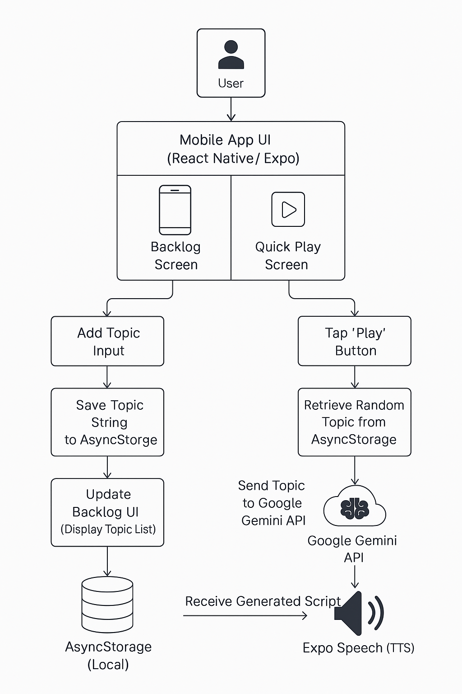

# Backlogz: AI Audio Note Manager

**Backlogz** is a mobile application developed using React Native and Expo, conceived during the SF Hacks 2025 hackathon. It helps you manage a backlog of topics or ideas and quickly generate listenable AI-powered audio summaries for review.

## Features

*   **Topic Management:** Add, view, and manage your list of topics or ideas within the app.
*   **AI-Generated Audio Summaries:** Select a topic and Backlogz uses the Google Gemini API to generate a concise, podcast-style script.
*   **Text-to-Speech Playback:** Listen to the generated summaries directly within the app using the device's native TTS capabilities.
*   **Quick Play:** Randomly select and play a topic from your backlog for spontaneous review.
*   **Intuitive UI:** Simple navigation using tabs for managing your backlog and playing summaries.
*   **(Planned/Partial):** Cloud storage integration (potentially Firebase) and note management associated with topics.

## Tech Stack

*   **Frontend:** React Native, Expo 
*   **Language:** TypeScript
*   **Navigation:** Expo Router (File-based routing)
*   **AI:** Google Gemini API
*   **Speech:** Expo Speech
*   **Local Storage:** AsyncStorage (for topic list)
*   **(Potential):** Firebase (for cloud storage/other features)

## Problem Statement

Managing and reviewing a growing backlog of ideas, articles, or notes can be overwhelming and time-consuming. It's easy for valuable thoughts to get lost. Backlogz addresses this by transforming static text entries into easily digestible AI-generated audio summaries, making review effortless and passive.

## Architecture



## Getting Started

### Prerequisites

*   Node.js (LTS version recommended)
*   npm or yarn
*   Expo Go app on your mobile device or an Android/iOS simulator setup.
*   **Google Gemini API Key:** You need an API key from Google AI Studio. Get one [here](https://ai.google.dev/).

### Installation & Setup

1.  **Clone the repository:**
    ```bash
    git clone <your-repository-url>
    cd back-logz
    ```

2.  **Install dependencies:**
    ```bash
    npm install
    # or
    # yarn install
    ```

3.  **Add your Gemini API Key:**
    *   Open the file `app/(tabs)/index.tsx`.
    *   Find the line: `const GEMINI_API_KEY = 'YOUR_API_KEY_HERE';`
    *   Replace `'YOUR_API_KEY_HERE'` with your actual Google Gemini API key.
    *   **Note:** For production apps, it's strongly recommended to use environment variables (e.g., via a `.env` file and `expo-constants`) instead of hardcoding keys directly in the source code.

4.  **Start the development server:**
    ```bash
    npx expo start
    ```

5.  **Run the app:**
    *   Scan the QR code shown in the terminal with the Expo Go app on your device.
    *   Or, press `a` to run on an Android emulator, `i` for an iOS simulator, or `w` for web (if configured).

## Usage

1.  **Add Topics:** Navigate to the "My Topics" (or similarly named) tab. Use the interface provided to add the topics or ideas you want to keep track of.
2.  **Quick Play:** Go to the "Quick Play" tab. Tap the large play button to have the app randomly select a topic from your list, generate an audio summary using Gemini, and play it back using Text-to-Speech.
3.  **Stop Playback:** While playing, a stop button will appear if you wish to interrupt the audio.

## Future Development Roadmap

### Short-term (Next Steps)
*   **Notes Feature:** Implement functionality to add, view, and edit detailed notes associated with each topic.
*   **Cloud Storage/Sync:** Explore integrating Firebase (or another cloud solution) for backing up topics and potentially enabling cross-device synchronization.
*   **Improved Error Handling:** Enhance feedback for API errors or speech generation issues.
*   **Configuration:** Allow users to configure voice/speed for Text-to-Speech.

### Medium-term
*   **User Accounts:** Implement user authentication for personalized backlogs.
*   **Topic Organization:** Add features like tagging or categorization for topics.
*   **Web Interface:** Consider a web-based version for managing topics.

## License

This project is licensed under the MIT License - see the LICENSE file for details. (Ensure a LICENSE file exists in the repo).

## Resources

*    **GitHub Repository:** https://github.com/ChesterCaii/back-logz
*    **Demo Video:** [Watch Demo Video](https://youtu.be/-nsNqsaW5cQ?si=xOu7533TUwYYKeHS)
*    **Short Demo Video:** [Watch Demo Video](https://youtu.be/-nsNqsaW5cQ?si=xOu7533TUwYYKeHS)

## Contributing

Contributions are welcome! Please feel free to fork the repository, make your changes, and submit a Pull Request. For major changes, please open an issue first to discuss what you would like to change.

## Acknowledgements

This project was created during **SF Hacks 2025**.
